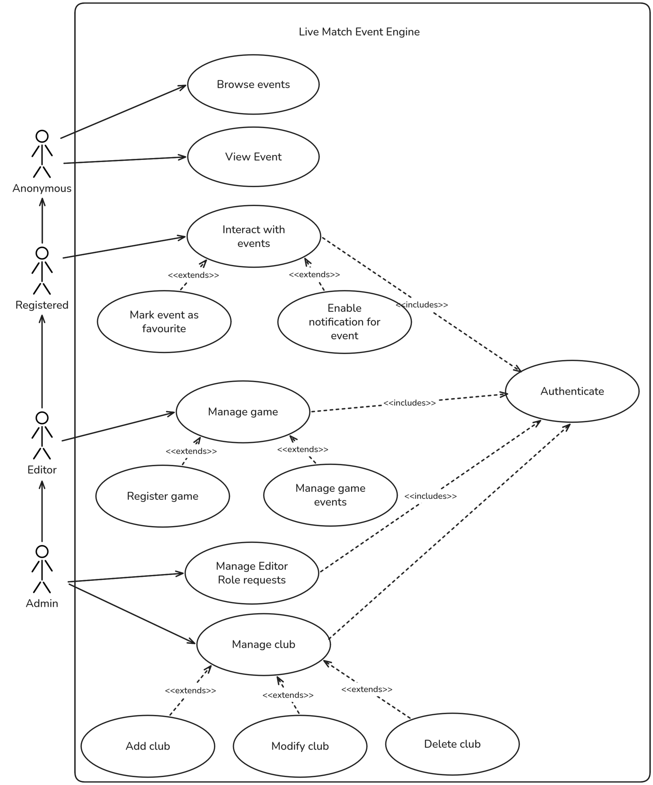
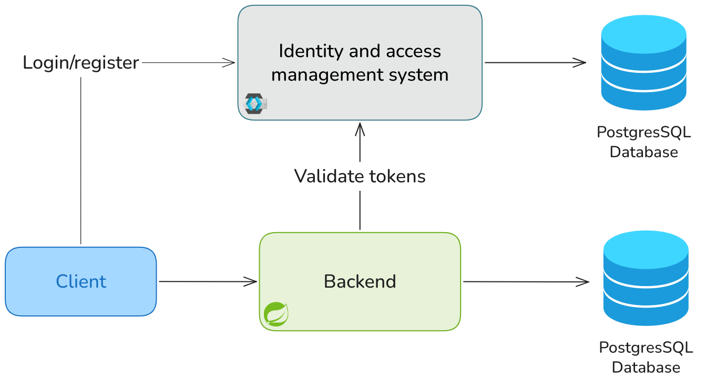
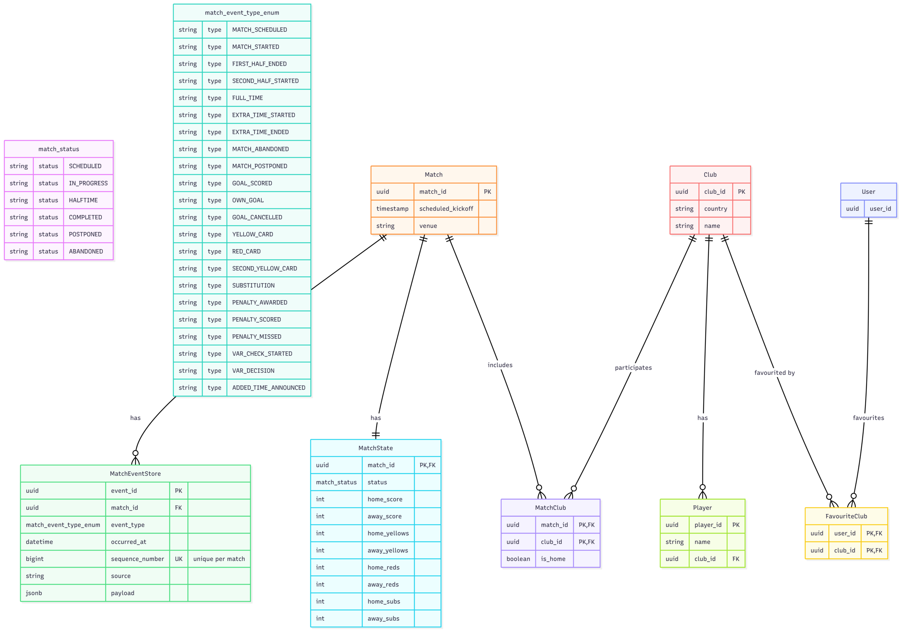
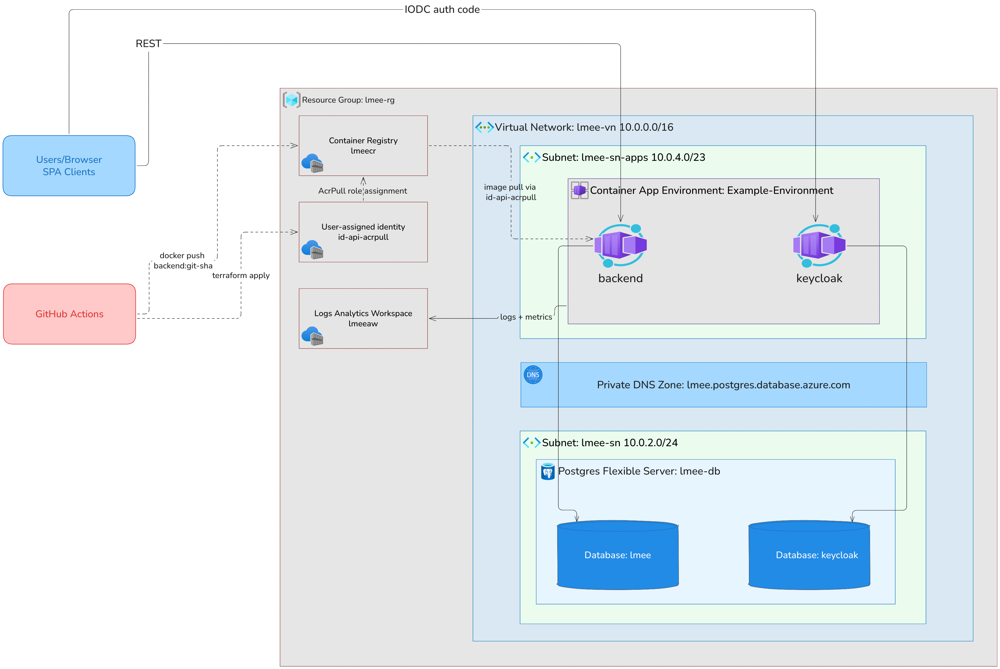

# LMEE Backend

Live Match Event Engine (LMEE) shows football matches in real time.

An operator records each incident of a match. The backend keeps the incident as an event, updates
the score, and sends the event to all connected clients. The backend uses event sourcing: it never
changes or deletes an event. To correct a mistake, it adds a new event.

| Resource | Address |
| --- | --- |
| API | https://backend.redisland-a629e2ff.centralus.azurecontainerapps.io |
| Swagger UI | https://backend.redisland-a629e2ff.centralus.azurecontainerapps.io/swagger-ui.html |
| Keycloak | https://keycloak.redisland-a629e2ff.centralus.azurecontainerapps.io |
| Web app | https://zealous-dune-00b527710.5.azurestaticapps.net |
| Frontend repository | [RaidThabet/lmee-frontend](https://github.com/RaidThabet/lmee-frontend) |

## Features

- Event-sourced match engine with an append-only event store
- Read model that keeps the score, the cards and the substitutions
- Live updates with STOMP over WebSocket
- Domain rules for the match lifecycle, discipline, penalties and VAR
- Keycloak authentication with hierarchical roles
- OpenAPI documentation with Swagger UI
- Infrastructure as code with Terraform, and deployment with GitHub Actions

Built with Spring Boot 4.1, Java 25, PostgreSQL 18, Flyway and Keycloak 26.

## Roles

Keycloak keeps the roles as realm roles. The roles are hierarchical: ADMIN includes OPERATOR, and
OPERATOR includes REGISTERED.

| Role | Permissions |
| --- | --- |
| Anonymous | Read the matches, the scores and the events. A token is not necessary. |
| REGISTERED | The same reads, but with an identity. |
| OPERATOR | Record the match events. |
| ADMIN | Manage the clubs, the players and the matches. |



## How it works



One service does the reads and the writes. The browser sends REST requests and opens one WebSocket
subscription for each open match. Keycloak makes the tokens. The backend only validates them.

When the backend receives a command:

1. It makes sure that the club and the players exist.
2. It reads all events of the match in sequence and builds a `MatchAggregate`.
3. The aggregate applies the domain rules. It then makes new events, or it refuses the command.
4. The backend writes the new events to `match_event_store` as JSONB.
5. The projection updates the `matches_states` row in the same transaction.
6. After the commit, the publisher sends each event to `/topic/matches/{matchId}`.

A read does not touch the event store. `GET /matches/{id}/state` reads the projection.

<details>
<summary>Event types</summary>

Each event has a `matchId` and an `occurredAt`. The `sequence_number` starts at 1 for each match.

| Event type | Other fields |
| --- | --- |
| `MATCH_SCHEDULED` | `homeClubId`, `awayClubId`, `kickoff`, `venue` |
| `MATCH_STARTED`, `FIRST_HALF_ENDED`, `SECOND_HALF_STARTED`, `FULL_TIME` | none |
| `MATCH_ABANDONED` | `reason`, `minute` |
| `MATCH_POSTPONED` | `reason` |
| `GOAL_SCORED`, `OWN_GOAL`, `PENALTY_SCORED`, `PENALTY_MISSED` | `clubId`, `playerId`, `minute` |
| `GOAL_CANCELED`, `PENALTY_AWARDED` | `clubId`, `minute` |
| `YELLOW_CARD_GIVEN`, `SECOND_YELLOW_CARD`, `RED_CARD_GIVEN` | `clubId`, `playerId`, `minute` |
| `SUBSTITUTION` | `clubId`, `playerOutId`, `playerInId`, `minute` |
| `VAR_CHECK_STARTED` | `reason`, `minute` |
| `VAR_DECISION` | `decision`, `minute` |
| `ADDED_TIME_ANNOUNCED` | `addedMinutes` |

An own goal adds one goal to the other club. A cancelled goal removes one goal.

</details>

<details>
<summary>Domain rules</summary>

[`MatchAggregate`](src/main/java/com/raid/lmee/domain/aggregate/MatchAggregate.java) applies these
rules. Each rule has its own exception.

- A match starts only from the status `SCHEDULED`, and only one time.
- The second half starts only from the status `HALF_TIME`. Full time is possible only in the second
  half.
- A half does not start and does not end while a VAR check is open.
- A goal, a card or a penalty is possible only while the match is in progress. The club must be one
  of the two clubs of the match.
- A club scores or misses a penalty only if that club has a penalty in progress.
- A new yellow card for a player who has one yellow card makes two events: `SECOND_YELLOW_CARD` and
  `RED_CARD_GIVEN`. The client does not send `SECOND_YELLOW_CARD`.
- A player who has a red card cannot get a new card or be part of a substitution.
- Each club has a maximum of 5 substitutions. A player who left the field cannot come back.

</details>

<details>
<summary>Data model</summary>



Flyway owns the schema in
[`V1__init_schema.sql`](src/main/resources/db/migration/V1__init_schema.sql). Hibernate runs with
`ddl-auto: validate`.

| Table | Function |
| --- | --- |
| `match_event_store` | Keeps the events. The payload is JSONB. `(match_id, sequence_number)` is unique. |
| `matches_states` | Keeps the projection: status, scores, cards and substitutions. |
| `matches`, `clubs`, `players`, `clubs_matches` | Keep the reference data. |
| `users`, `favourite_clubs` | Keep the local data of a Keycloak user. |

The class diagrams show the [domain layer](docs/img/domain-model.png) and the
[infrastructure and application layers](docs/img/infra-app-model.png).

</details>

## API

Read the full documentation at `/swagger-ui.html`. Get the OpenAPI file at `/v3/api-docs`.

| Method | Path | Role |
| --- | --- | --- |
| `GET` | `/matches` | Anonymous |
| `GET` | `/matches/{matchId}` | Anonymous |
| `GET` | `/matches/{matchId}/state` | Anonymous |
| `GET` | `/matches/{matchId}/events` | Anonymous |
| `POST` | `/matches` | ADMIN |
| `POST` | `/matches/{matchId}/events` | OPERATOR |
| `GET` | `/api/clubs`, `/api/players` | Anonymous |
| `POST` `PUT` `DELETE` | `/api/clubs`, `/api/players` | ADMIN |

A command has a `type` field with the same values as the event types. A command does not contain
`matchId`, because the path contains it. It does not contain `occurredAt`, because the aggregate
sets it. To add a match, use `POST /matches`.

```http
POST /matches/671eaf85-f7da-48c2-9ee9-cacca507ce04/events
Authorization: Bearer <token>
Content-Type: application/json

{
  "type": "GOAL_SCORED",
  "clubId": "b0e02ba6-5e99-41b9-a2b2-3b2388516e91",
  "playerId": "6c01cf40-7db0-47ba-8f97-37cb11278f0f",
  "minute": 63
}
```

The folder [`requests/`](requests) contains example requests for the IntelliJ HTTP client.

### WebSocket

Connect to `/ws` and subscribe to `/topic/matches/{matchId}`. Each message has this form:

```json
{ "type": "GOAL_SCORED", "event": { "sequenceNumber": 7, "minute": 63, "playerName": "Belaili" } }
```

> [!NOTE]
> The channel is read-only. The interceptor refuses each inbound `SEND` frame. Use REST to write.

### Errors

All errors use one JSON format, also for the status 401 and the status 403.

```json
{
  "code": "MATCH_NOT_FOUND",
  "message": "Match 671eaf85-f7da-48c2-9ee9-cacca507ce04 not found",
  "httpStatus": 404,
  "path": "/matches/671eaf85-f7da-48c2-9ee9-cacca507ce04"
}
```

## Security

- The backend is an OAuth2 resource server. It validates the token against `issuer-uri`. There is no
  session.
- `JwtAuthConverter` reads `realm_access.roles`, adds the prefix `ROLE_`, and expands the role
  hierarchy.
- `UserProvisioningFilter` adds the local `users` row at the first request of a new user.
- CORS uses the origin patterns in `lmee.cors.allowed-origin-patterns`. The WebSocket handshake uses
  the same list.

## Get started

You need JDK 25 and Docker.

### 1. Make the environment files

> [!IMPORTANT]
> There are two files with similar names. In `.env`, `LMEE_POSTGRES_DB` is a database name. In
> `.env.dev`, it is a JDBC URL. Git ignores both files.

`.env` is for Docker Compose. Copy [`.env.example`](.env.example) and add the values:

```dotenv
LMEE_POSTGRES_DB=lmee
LMEE_POSTGRES_USER=postgres
LMEE_POSTGRES_PASSWORD=<your password>
KEYCLOAK_DB_NAME=keycloak
KEYCLOAK_DB_USERNAME=keycloak
KEYCLOAK_DB_PASSWORD=<your password>
KEYCLOAK_ADMIN_USER=admin
KEYCLOAK_ADMIN_PASSWORD=<your password>
```

`.env.dev` is for the `dev` profile:

```dotenv
LMEE_POSTGRES_DB=jdbc:postgresql://localhost:5433/lmee
LMEE_POSTGRES_USER=postgres
LMEE_POSTGRES_PASSWORD=<the same password>
KEYCLOAK_ISSUER_URI=http://localhost:9090/realms/lmee
```

### 2. Start the application

```bash
./mvnw spring-boot:run
```

The Maven plugin selects the `dev` profile. Spring Boot starts and stops the containers with the
application. The API listens on port 8080, PostgreSQL on 5433, and Keycloak on 9090.

### 3. Configure Keycloak

Do these steps one time. Open http://localhost:9090 and log in as the admin user.

1. Make the realm `lmee`.
2. Make the realm roles `REGISTERED`, `OPERATOR` and `ADMIN`.
3. Make the public client `angular-app`. Set the redirect URI to `http://localhost:4200/*` and the
   web origin to `http://localhost:4200`. The frontend uses this client.
4. Make the confidential client `api-client` with direct access grants. The files in `requests/` use
   this client.
5. Make the users and give them the roles.

### 4. Add the example data

```bash
psql "postgresql://postgres:<password>@localhost:5433/lmee" -f players_seed.sql
```

### 5. Send requests

Run `requests/GetToken.http` first, because it keeps the token. Then run `CreateClub.http`,
`CreateMatch.http`, `StartMatch.http` and `AddEventsToMatch.http`. You can also use Swagger UI and
put a token in the **Authorize** field.

## Configuration

| Variable | Function |
| --- | --- |
| `SPRING_PROFILES_ACTIVE` | Selects the profile: `dev` or `prod` |
| `LMEE_POSTGRES_DB` | JDBC URL of the database |
| `LMEE_POSTGRES_USER`, `LMEE_POSTGRES_PASSWORD` | Database credentials |
| `KEYCLOAK_ISSUER_URI` | Issuer of the tokens |
| `lmee.cors.allowed-origin-patterns` | List of permitted origins |

The `dev` profile writes full stack traces and permits each localhost port. The `prod` profile
writes only messages, keeps the stack traces for 5xx errors, and permits only the web app origin.

## Build

```bash
./mvnw clean package
java -Dspring.profiles.active=prod -jar target/lmee-0.0.1-SNAPSHOT.jar
```

The [`Dockerfile`](Dockerfile) has two stages. It builds with Maven and runs on a JRE 25 image.

```bash
docker build -t lmee-backend .
```

## Deployment



The folder [`infra/`](infra) contains the Terraform code. Terraform keeps the state in an Azure
Storage account.

| Resource | Details |
| --- | --- |
| Resource group `lmee-rg` | Central US |
| Virtual network `lmee-vn` | One subnet for the database, one subnet for the container apps |
| PostgreSQL `lmee-db` | Version 18, `B_Standard_B1ms`, no public access, databases `lmee` and `keycloak` |
| Container app `backend` | Port 8080, 1 to 3 replicas |
| Container app `keycloak` | Keycloak 26.7.2, one replica, health probes on port 9000 |
| Container registry `lmeecr` | The container apps pull the images with a user-assigned identity |
| Log Analytics `lmeeaw` | Keeps the logs for 30 days |

Two workflows deploy the system. Both use an OIDC federated credential, so there is no stored
password.

- [`deploy.yml`](.github/workflows/deploy.yml) builds the application, pushes the image with the
  commit SHA, and updates the container app.
- [`infra.yml`](.github/workflows/infra.yml) runs `terraform plan` and `terraform apply` on a change
  in `infra/`.

> [!NOTE]
> Terraform ignores the image tag of the backend. The deploy workflow controls the tag.

## Project structure

```
src/main/java/com/raid/lmee/
├── domain/aggregate/   MatchAggregate: applies the rules and makes the events
├── domain/event/       The 20 event records
├── domain/             The JPA entities
├── projection/         MatchProjection: updates matches_states
├── service/            The application services
├── rest/               The controllers
├── websocket/          The publisher and the inbound interceptor
├── security/           JwtAuthConverter, Roles, UserProvisioningFilter
├── model/              The DTOs and the commands
├── config/             Security, CORS, WebSocket, Jackson, OpenAPI
├── exception/          One exception for each rule
└── swagger/            The reusable OpenAPI annotations
infra/                  The Terraform code
requests/               The example HTTP requests
```

## TODO

- [ ] Add club crest image upload.
- [ ] The broker keeps the subscriptions in memory. With more than one replica, a client does not get
  the events of the other replicas. An external broker can correct this.
- [ ] The tables for the favourite clubs exist, but there is no endpoint for them.
- [ ] There are no automated tests.
